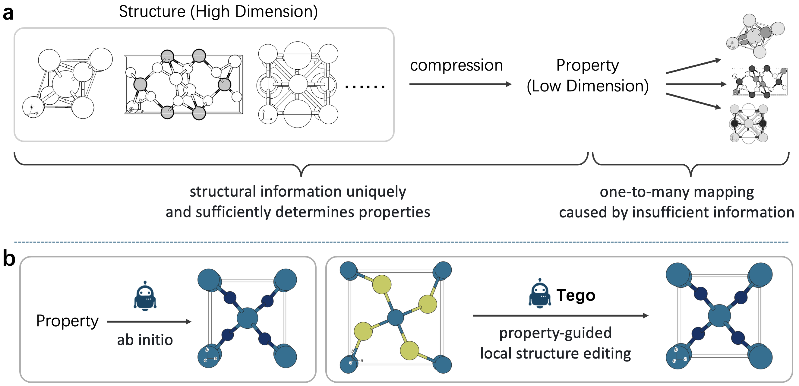
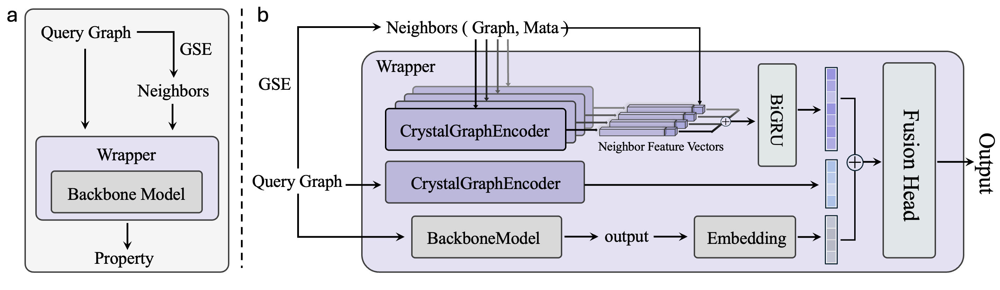
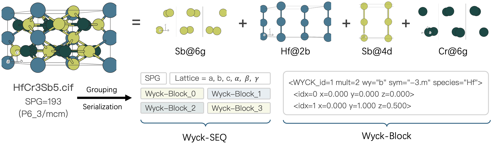
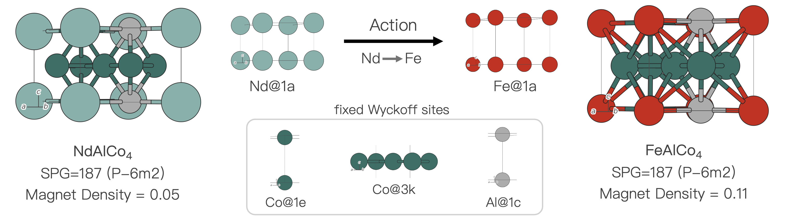
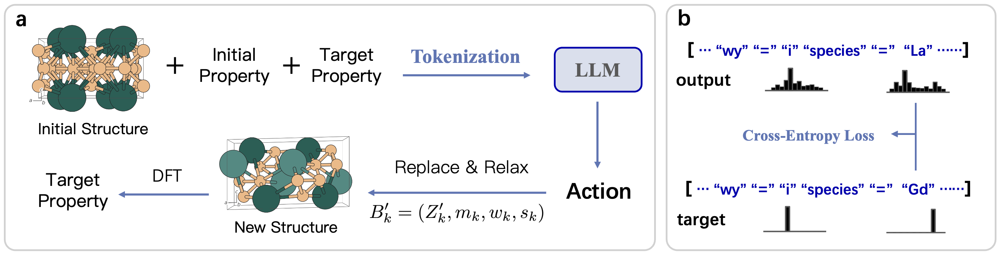

# Tego：面向目标性质的新材料迭代式逆向设计

**MateX** 是一个面向新物质研发的 AI 辅助设计系统，主要包含**逆向设计**与**性质预测**两部分。其中：

- **Tego**：负责面向目标性质的新材料迭代式逆向设计；
- **SimRAP**：负责晶体材料性质预测，为材料筛选、评价与逆向设计提供性质评估能力。

本仓库主要公开 **MateX 中 Tego 模块的训练与推理代码**。

Tego 根据**初始晶体结构、当前材料性质与目标性质**，自动生成局部结构编辑动作，并结合材料势能模型与性质预测模型对候选结构进行评估，从而完成多轮迭代式材料设计。



实验所使用的数据集单独公开于：

```text
https://anonymous.4open.science/r/Tego-derivation
```

MateX 中的性质预测模块 **SimRAP** 面向晶体材料性质预测任务。
它通过 GSE（Group-Site-Element）结构相似性检索引入外部相似材料作为先验，并结合基础预测模型输出进行融合，从而提升预测精度



**SimRAP** 单独公开于：

```text
https://anonymous.4open.science/r/SimRAP
```

---

## 1. 项目结构

```text
Tego/
├── train.py                 # LoRA 训练脚本
├── infer.py                 # 迭代式逆向设计与评估
├── requirements.txt         # Python 依赖
├── environment.yml          # Conda 环境配置
├── scripts/
│   ├── train.sh             # 训练示例
│   └── infer.sh             # 推理示例
└── README.md
```

其中：

- `train.py`：训练晶体结构编辑模型；
- `infer.py`：执行完整的材料逆向设计流程；
- `scripts/`：提供基本的训练与推理命令示例。

---

# 2. 方法概览



Tego 将晶体结构转换为 **Wyck-SEQ** 表示，并将一次材料设计建模为对某个 Wyckoff 等价位点的局部编辑。

模型的基本输入包括：

```text
当前晶体结构
+
当前性质值
+
目标性质值
```

模型输出一个结构编辑动作：

```text
<ACTION>
<WYCK_id=... mult=... wy="..." sym="..." species="...">
<\ACTION>
```



该动作表示选择一个已有的 Wyckoff 等价位点，并修改其元素种类，同时保持晶格、坐标、Wyckoff multiplicity 和位点对称性等结构信息不变。

---

# 3. 训练

训练脚本：

```text
train.py
```

训练采用 LoRA 对大语言模型进行监督微调。

每条训练数据主要包含：

| 字段 | 含义 |
|---|---|
| `original_Wyck-SEQ` | 初始晶体的 Wyck-SEQ 表示 |
| `original_mag_density` | 当前磁矩密度 |
| `candidate_mag_density` | 目标磁矩密度 |
| `action` | 对应的结构编辑动作 |

其中输入部分仅作为条件，模型主要学习生成目标 `action`。



---

## 3.1 环境配置

推荐使用 Conda：

```bash
conda env create -f environment.yml
conda activate tego
```

也可以直接安装依赖：

```bash
pip install -r requirements.txt
```

---

## 3.2 单卡训练

基本命令：

```bash
python train.py \
  --model_path /path/to/base_model \
  --train_csv /path/to/train.csv \
  --output_dir outputs/train \
  --num_train_epochs 10 \
  --per_device_train_batch_size 2 \
  --gradient_accumulation_steps 8 \
  --max_seq_length 1300 \
  --precision bf16
```

---

## 3.3 多卡训练

例如使用 4 张 GPU：

```bash
CUDA_VISIBLE_DEVICES=0,1,2,3 torchrun \
  --nproc_per_node=4 \
  train.py \
  --model_path /path/to/base_model \
  --train_csv /path/to/train.csv \
  --output_dir outputs/train \
  --num_train_epochs 10 \
  --per_device_train_batch_size 2 \
  --gradient_accumulation_steps 8 \
  --precision bf16
```

也可以直接修改：

```text
scripts/train.sh
```

中的模型路径、数据路径与 GPU 配置后运行。

---

# 4. 迭代式逆向设计

推理脚本：

```text
infer.py
```

Tego 的推理过程不是一次性生成最终晶体，而是执行多轮结构编辑与评估。

基本流程为：

```text
Initial CIF
    ↓
Wyck-SEQ
    ↓
LLM / LoRA
    ↓
Structure Editing
    ↓
MatterSim Relaxation
    ↓
Stability Filtering
    ↓
Property Evaluation
    ↓
Candidate Selection
    ↓
Next Round
```

在每轮设计过程中，模型首先根据当前晶体结构与目标性质生成一个或多个结构编辑动作。

生成的新结构经过 MatterSim 松弛与能量评估后，对明显不稳定的候选结构进行过滤，再利用性质预测模型进行评估，并选择更合适的候选结构进入下一轮。

因此，Tego 可以保留完整的结构演化轨迹，而不仅仅输出最终结果。

当前公开代码以**磁矩密度逆向设计**为例，并使用 CHGNet 完成候选结构的磁性性质评估。

---

## 4.1 推理示例

```bash
python infer.py \
  --model_path /path/to/base_model \
  --lora_path /path/to/lora_checkpoint \
  --input_csv /path/to/input.csv \
  --cif_col cif \
  --output_dir outputs/inference \
  --target_mag_density 0.01 \
  --num_rounds 5 \
  --k 3 \
  --precision bf16
```

其中：

| 参数 | 含义 |
|---|---|
| `model_path` | 基础语言模型 |
| `lora_path` | 训练得到的 LoRA 权重 |
| `input_csv` | 输入晶体数据 |
| `cif_col` | CIF 所在列名 |
| `target_mag_density` | 目标磁矩密度 |
| `num_rounds` | 最大设计轮数 |
| `k` | 每轮生成的候选动作数量 |
| `output_dir` | 结果保存目录 |

如果不指定 LoRA 权重，也可以直接使用基础模型进行推理。

---

# 5. 推理结果

推理过程中会记录每个材料的完整设计轨迹，包括：

- 初始晶体结构；
- Wyck-SEQ 表示；
- 每轮生成的结构编辑动作；
- 编辑后的候选晶体；
- MatterSim 松弛结果；
- 候选结构能量；
- 性质预测结果；
- 每轮最终选择的候选结构；
- 最终设计结果。

结果会保存到指定的：

```text
output_dir
```

便于后续统计、可视化与实验分析。

---

# 6. 数据集

本文实验数据没有直接存放在 GitHub 仓库中。

公开数据集与相关实验数据可以从以下地址获取：

```text
https://anonymous.4open.science/r/Tego-derivation
```

下载数据后，只需要在训练或推理命令中修改对应的 CSV 路径即可。

---

# 7. SimRAP：MateX 性质预测模块

**SimRAP** 是 MateX 中负责**材料性质预测**的模块，与负责逆向设计的 Tego 相互独立。

给定一个晶体结构，SimRAP 可以对其目标材料性质进行预测，为材料筛选、候选结构评价以及 MateX 的逆向设计流程提供性质信息。

SimRAP 的代码单独公开于：

```text
https://anonymous.4open.science/r/SimRAP
```

因此，MateX 的两个主要模块可以概括为：

```text
MateX
├── Tego    → 面向目标性质的材料逆向设计
└── SimRAP  → 晶体材料性质预测
```

本仓库聚焦于 **Tego 的训练与推理流程**。如需使用或复现 SimRAP，请访问其独立代码仓库。

---

# 8. 依赖模型

当前 Tego 推理流程主要涉及：

- **LLM + LoRA**：生成晶体局部结构编辑动作；
- **pymatgen**：晶体结构解析、空间群与 Wyckoff 信息处理；
- **MatterSim**：结构松弛与势能评估；
- **CHGNet**：当前磁矩密度任务中的候选结构性质评估。

不同模块相互独立，因此可以根据具体实验任务替换相应的性质预测模型。

MateX 中独立的性质预测工具 **SimRAP** 请参见：

```text
https://anonymous.4open.science/r/SimRAP
```

---

# 9. 快速开始

克隆仓库：

```bash
git clone https://github.com/YOUR_USERNAME/Tego.git
cd Tego
```

配置环境：

```bash
conda env create -f environment.yml
conda activate tego
```

准备数据和基础模型后，可以分别运行：

```bash
bash scripts/train.sh
```

和：

```bash
bash scripts/infer.sh
```

完成 Tego 的训练与迭代式材料逆向设计。